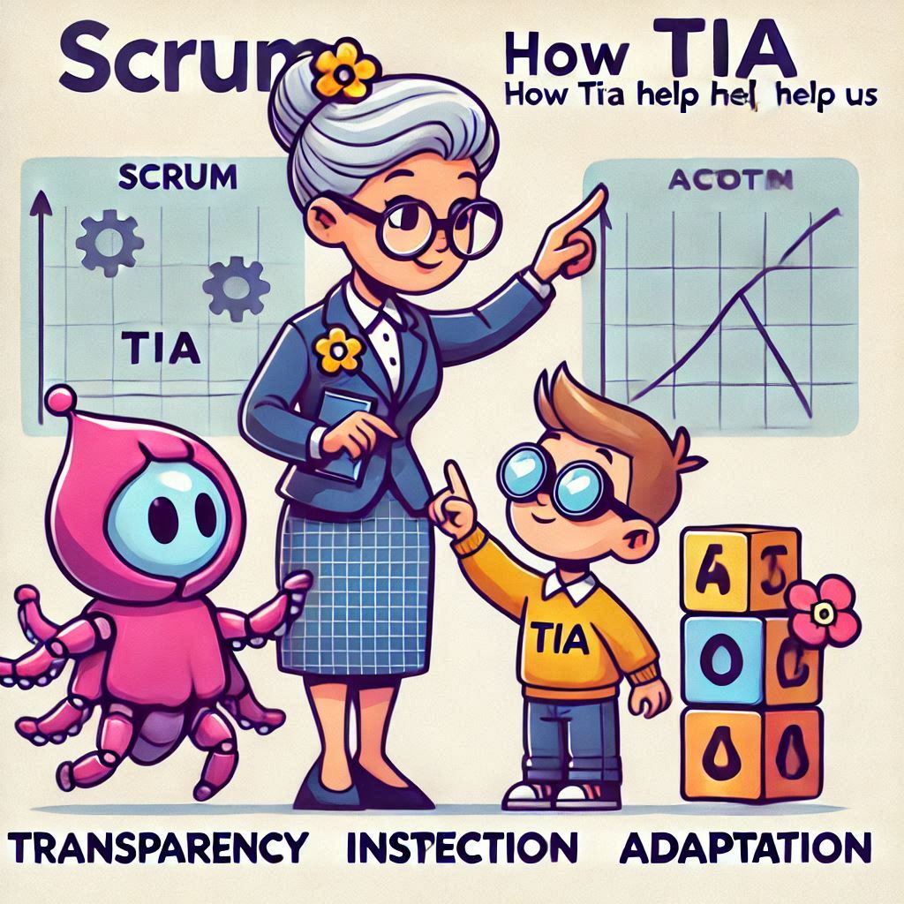

# Artigos gerados com ajuda de IA

Material bruto dos artigos, como prompts, pesquisas, imagens e links

## Links

### 1. [**IA na Tomada de Decisão: Benefícios Estratégicos e Limitações Práticas**](./IA_na_tomada_decisao/readme.md)

<table style="border: none;">
    <tr style="border: none;">
        <td style="border: none;">
            
        </td>
        <td style="border: none;">
            <em>#Inteligência Artificial</em> 
            <em>28/12/2024</em>
        </td>
    </tr>
</table>

| Site | Publicação | Link |
| --- | --- | --- |
| *dio.me* | 28/12/2024 | https://web.dio.me/articles/ia-na-tomada-de-decisao-beneficios-estrategicos-e-limitacoes-praticas?back=%2Farticles&page=1&order=oldest |

### 2. [**Scrum, como a TIA pode nos ajudar?**](./scrum-tia/README.md)

<table style="border: none;">
    <tr style="border: none;">
        <td style="border: none;">
            
        </td>
        <td style="border: none;">
            <em>#Gestão #Scrum #Ágil</em> 
            <em>30/12/2024</em>
        </td>
    </tr>
</table>

| Site | Publicação | Link |
| --- | --- | --- |
| *dio.me* |  |

### 3. [**O Ritmo do Scrum: Uma Jornada em 5 Eventos**](./o_ritmo_scrum/README.md)

<table style="border: none;">
    <tr style="border: none;">
        <td style="border: none;">
            
        </td>
        <td style="border: none;">
            <em>#Gestão #Scrum #Ágil</em> 
            <em>03/01/2025</em>
        </td>
    </tr>
</table>

| Site | Publicação | Link |
| --- | --- | --- |
| *dio.me* |  |