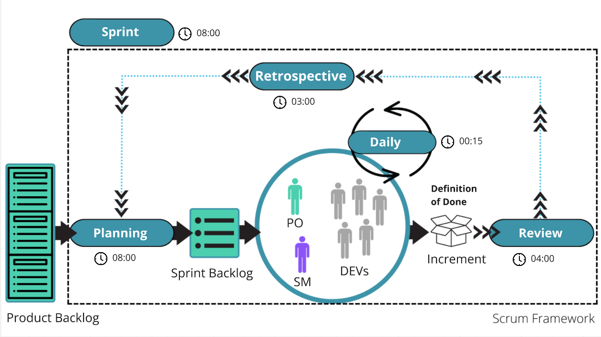

# O Ritmo do Scrum: Uma Jornada em 5 Eventos

## Introdução

Os enventos do Scrum são reuniões regulares e curtas que ocorrem durante um Sprint, com o objetivo de promover a colaboração, a **transparência** e a **inspeção** do progresso do projeto e a **adaptação** para evitar o retrabalho.

A trasparência, inspeção e a adaptação são os pilares do Scrum.
* **Transparência:** Todos os aspectos do processo devem ser visíveis a todos os envolvidos no projeto.
* **Inspeção:** O progresso e o produto devem ser inspecionados regularmente para identificar desvios e oportunidades de melhoria.
* **Adaptação:** O processo e o produto devem ser ajustados quando necessário para garantir que o projeto esteja no caminho certo.

## Os 5 eventos que movem seu projeto

O Scrum utiliza cinco eventos principais para garantir o sucesso de um projeto: Sprint Planning, Daily Scrum, Sprint Review, Sprint Retrospective e Refinamento do Backlog. Esses eventos proporcionam uma estrutura para a equipe, promovendo a colaboração, a transparência e a adaptação contínua.

### 1. Spring - Refinamento do Product Backlog

* **Objetivo:** Clarificar e detalhar os itens do Product Backlog para que a equipe possa planejar as próximas sprints.
* **O que acontece:** O Product Owner e o Time de Desenvolvimento trabalham juntos para refinar os itens do Product Backlog, garantindo que eles estejam claros e prontos para serem implementados.
* **Importância:** Assegura que o Product Backlog esteja sempre atualizado e que a equipe tenha uma visão clara do trabalho a ser realizado.

### 2. Sprint Planning

* **Objetivo:** Definir o trabalho a ser realizado durante a próxima sprint.
* **O que acontece:** A equipe, junto com o Product Owner (PO), seleciona os itens do Product Backlog que serão implementados e define o ***Sprint Goal*** (objetivo da sprint).
* **Importância:** Garante que a equipe esteja alinhada e focada em um objetivo comum.

### 3. Daily Scrum

* **Objetivo:** Sincronizar o trabalho diário da equipe e identificar impedimentos.
* **O que acontece:** Uma reunião rápida (idealmente de 15 minutos) onde pretentede verifica impedimentos e avanços-
* **Importância:** Mantém a equipe focada, promove a colaboração e permite que os impedimentos sejam resolvidos rapidamente.

### 4. Sprint Review

* **Objetivo:** Inspecionar o incremento criado durante a sprint e obter feedback das partes interessadas.
* **O que acontece:** A equipe demonstra o trabalho concluído e coleta feedback para o Product Backlog.
* **Importância:** Permite que a equipe ajuste o Product Backlog com base no feedback recebido e valida o valor entregue ao cliente.

### 5. Sprint Retrospective

* **Objetivo:** Inspecionar o processo utilizado durante a sprint e identificar oportunidades de melhoria.
* **O que acontece:** A equipe reflete sobre o que funcionou bem, o que não funcionou e o que pode ser melhorado.
* **Importância:** Promove a melhoria contínua do processo e da equipe

## Tempo (TimeBox) Indicado para cada evento do Scrum 

O Scrum Guide não especifica um tempo exato para cada evento, mas sim um tempo máximo. Isso permite que as equipes se adaptem à sua realidade e complexidade do projeto.

"**Uma Sprint deve ser pequena o suficiente para ser gerenciável e grande o suficiente para entregar um incremento de valor ao produto.**"

O Scrum Guide enfatiza que a duração da Sprint deve ser cuidadosamente balanceada para maximizar a produtividade e a entrega de valor.

* **Pequena o suficiente:**
   * **Gerenciabilidade:** Sprints curtas facilitam o planejamento, o acompanhamento e o ajuste do trabalho.
   * **Flexibilidade:** Permite que a equipe se adapte rapidamente a mudanças e aprendizados.
   * **Redução de riscos:** Problemas menores podem ser identificados e resolvidos mais rapidamente.

* **Grande o suficiente:**
   * **Entrega de valor:** A Sprint deve resultar em um incremento do produto que seja funcional e entregue valor ao cliente.
   * **Momento:** Permite que a equipe entre em um ritmo consistente de trabalho e evite interrupções constantes.

### Diretrizes para um timebox

| Evento | Timebox de 1 semana | Timebox de 1 mês | Adaptação | Participantes | Inspeção |
| --- | :---: | :---: | --- | --- | --- |
| Sprint Planning | 02:00 | 08:00 | backlogo do produto, meta da sprint | equipe scrum | product backlog, meta do produto, definição do produto
| Daily Scrum | 00:15 | 00:15 | backlog da spring | desenvolvedores | progresso em direção à meta do produto |
| Sprint Review | 01:00 | 04:00 | backlog do produto | equipe e interessados |incremento, sprint, product backlog, métricas |
| Sprint Retrospective | 00:45 | 03:00 | melhorias acionáveis, definição de pronto | equipe scrum | sprint, definição de pronto |

## Concluindo

Apesar do Scrum Guide, não definir um tempo na pedra para evento, segue uma sugestão de tempo médio que a comunidade pratica, o ideal é que a equipe experimente e ajuste o tempo dedicado a cada evento de acordo com suas necessidades e o feedback obtido.

| **Algumas dicas** | |
|--|--|
|**Manter o foco**| Evitar que as reuniões se prolonguem desnecessariamente.|
|**Preparação** | Os participantes devem chegar preparados para as reuniões, com os dados e informações necessárias.|
|**Participação** | Incentivar a participação de todos os membros da equipe.|
|**Ação** | Transformar as decisões tomadas nas reuniões em ações concretas.|

 

#### Fontes de referência

Scrum Guide - https://scrumguides.org/ - 2024-01-03

---

***Artigo gerado com auxilio de inteligencia artificial:***
***Prompt no [Gemini](https://gemini.google.com/)***

Imagens: [FreePik](https://www.freepik.com/)
Edição de Imagens: [Photopea](https://www.photopea.com/) opção free ao Photoshop

    <a href="https://github.com/dannyrooh/articles/blob/main/o_ritmo_scrum/README.md" style="display: flex; align-items: center;">
        
        <strong>Acesse o prompt do artigo</strong>
    </a>

 

***#Gestão #Ágil #Scrum***

---

   
   by Dannyrooh F Campos - 03 de janeiro de 2025

 

